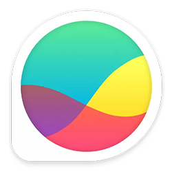

# Hey there 👋

I am Acme, an enthusiast who loves to code 🙂.

## Languages

<table>
  <tr>
    <td>
      <!-- HTML -->
      
    </td>
    <td>
      <!-- CSS -->
      
    </td>
    <td>
      <!-- JavaScript -->
     
    </td>
    <td>
      <!-- Python -->
      
    </td>
    <td>
      <!-- Java -->
      
    </td>
    <td>
      <!-- Solidity -->
      
    </td>
  </tr>
</table>

## Tools

### Full Stack Development

<table>
  
  <!-- Row 1 -->
  <tr>
    <td>
     <!-- Tailwind CSS -->
       
    </td>
    <td>
      <!-- SASS -->
      
    </td>
    <td>
    <!-- LESS -->
       
    </td>
    <td>
      <!-- Bootstrap -->
      
    </td>
  </tr>
  
  <!-- Row 2 -->
  <tr>
    <td>
     <!-- Node JS -->
       
    </td>
    <td>
      <!-- ES Lint -->
      
    </td>
    <td>
    <!-- Express -->
       
    </td>
    <td>
      <!-- React -->
       
    </td>
    <td>
      <!-- Next -->
       
    </td>
  </tr>

  <!-- Row 3 -->
  <tr>
    <td>
      <!-- Firebase -->
      
    </td>
    <td>
      <!-- MongoDB -->
      
    </td>
  </tr>

 <!-- Row 4 -->
  <tr>
    <td>
      <!-- Heroku -->
      
    </td> 
    <td>
      <!-- AWS -->
      
    </td>
    <td>
      <!-- CircleCI -->
      
    </td>
     <td>
      <!-- Nginx -->
       
    </td>
    <td>
      <!-- Apache -->
       
    </td>
  </tr>

</table>

### Data Science

<table>
  <tr>
    <td>
      <!-- Anaconda -->
      
    </td>
    <td>
      <!-- Pandas -->
      
    </td>
    <td>
      <!-- Numpy -->
      
    </td>
    <td>
      <!-- MATLAB -->
      
    </td>
    <td>
      <!-- Tensorflow -->
      
    </td>
  </tr>
</table>

### Networking

<table>
  <tr>
    <td>
      <!-- Packet Tracer -->
      
    </td>
    <td>
      <!-- Wire Shark -->
      
    </td>
    <td>
      <!-- Glass Wire -->
      
    </td>
  </tr>
</table>

## Github Statistics

<table>
  <tr>
    <td>
      
    </td>
    <td>
      
    </td>
  </tr>
</table>
