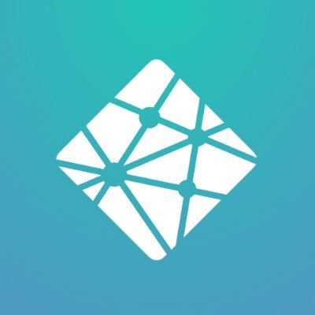

# Hey there 👋

I am Acme, an enthusiast who loves to code 🙂. For more projects that I am working over, head over to [AM Designers](https://github.com/AM-Designers) or [Yaruhito](https://github.com/Yaruhito) 😊.

## Languages 🌆

<table>
  <tr>
    <td>
      <!-- HTML -->
      
    </td>
    <td>
      <!-- CSS -->
      
    </td>
    <td>
      <!-- JavaScript -->
     
    </td>
    <td>
      <!-- Python -->
      
    </td>
    <td>
      <!-- Java -->
      
    </td>
    <td>
      <!-- Solidity -->
      
    </td>
  </tr>
</table>

## Tools 🧰

### Full Stack Development 🚀

<table>
  
  <!-- Row 1 -->
  <tr>
    <td>
     <!-- Tailwind CSS -->
       
    </td>
    <td>
      <!-- SASS -->
      
    </td>
    <td>
    <!-- LESS -->
       
    </td>
    <td>
      <!-- Bootstrap -->
      
    </td>
    <td>
     <!-- JQuery -->
       
    </td>
    <td>
     <!-- Material UI -->
       
    </td>
    <td>
     <!-- LaTeX -->
       
    </td>
    <td>
     <!-- Fluent UI -->
       
    </td>
    <td>
     <!-- Charkra UI -->
       
    </td>  
  </tr>
  
  <!-- Row 2 -->
  <tr>
    <td>
     <!-- Node JS -->
       
    </td>
    <td>
      <!-- ES Lint -->
      
    </td>
    <td>
    <!-- Express -->
       
    </td>
    <td>
    <!-- Babel -->
       
    </td>
    <td>
      <!-- React -->
       
    </td>
    <td>
      <!-- Next -->
       
    </td>
    <td>
      <!-- Electron -->
       
    </td>
    <td>
      <!-- Selenium -->
       
    </td>
    <td>
      <!-- Moocha -->
       
    </td>
  </tr>

  <!-- Row 3 -->
  <tr>
    <td>
      <!-- Firebase -->
      
    </td>
    <td>
      <!-- MongoDB -->
      
    </td>
    <td>
      <!-- MySQL -->
      
    </td>
  </tr>

 <!-- Row 4 -->
  <tr>
    <td>
      <!-- Heroku -->
      
    </td> 
    <td>
      <!-- AWS -->
      
    </td>
    <td>
      <!-- CircleCI -->
      
    </td>
    <td>
      <!-- Google Cloud -->
       
    </td>
    <td>
      <!-- Hostinger -->
       
    </td>
    <td>
      <!-- Vercel -->
       
    </td>
    <td>
      <!-- Netlify -->
       
    </td>
     <td>
      <!-- Nginx -->
       
    </td>
    <td>
      <!-- Apache -->
       
    </td>
  </tr>

</table>

### Data Science 📈

<table>
  <tr>
    <td>
      <!-- Anaconda -->
      
    </td>
    <td>
      <!-- Jypyter -->
      
    </td>
    <td>
      <!-- Pandas -->
      
    </td>
    <td>
      <!-- Numpy -->
      
    </td>
    <td>
      <!-- MATLAB -->
      
    </td>
    <td>
      <!-- Tensorflow -->
      
    </td>
  </tr>
</table>

### Networking 🌐

<table>
  <tr>
    <td>
      <!-- Packet Tracer -->
      
    </td>
    <td>
      <!-- Wire Shark -->
      
    </td>
    <td>
      <!-- Glass Wire -->
      
    </td>
  </tr>
</table>

### Graphic/UI Designing 🎨

<table>
  <tr>
    <td>
      <!-- Photoshop -->
      
    </td>
    <td>
      <!-- Illustrator -->
      
    </td>
    <td>
      <!-- Adobe XD -->
      
    </td>
    <td>
      <!-- Invision -->
      
    </td>
  </tr>
</table>

## Currently Learning 📚

<table>
  <tr>
    <!-- Socket.io -->
    <td>
      
    </td>
    <td>
       🔵🔵🔵⚪️⚪️⚪️⚪️⚪️⚪️⚪️
    </td>
    <!-- WebRTC -->
    <td>
      
    </td>
    <td>
      <!-- Progress -->
       🔵⚪️⚪️⚪️⚪️⚪️⚪️⚪️⚪️⚪️
    </td>
  </tr>
  <tr>
    <!-- SolidJS -->
    <td>  
      
    </td>
    <td>
      <!-- Progress -->
       🔵🔵🔵🔵🔵⚪️⚪️⚪️⚪️⚪️
    </td>
    <!-- TypeScript -->
    <td>
      
    </td>
    <td>
      <!-- Progress -->
       🔵🔵⚪️⚪️⚪️⚪️⚪️⚪️⚪️⚪️
    </td>
  </tr>
  
  <tr>
    <!-- Dot-Net -->
    <td>
      
    </td>
    <td>
      <!-- Progress -->
       🔵⚪️⚪️⚪️⚪️⚪️⚪️⚪️⚪️⚪️
    </td>
    <!-- Dot-Net Core -->
    <td>
      
    </td>
    <td>
      <!-- Progress -->
       🔵⚪️⚪️⚪️⚪️⚪️⚪️⚪️⚪️⚪️
    </td>
  </tr>
  <tr>
    <!-- Spring Boot -->
    <td>
      
    </td>
    <td>
      <!-- Progress -->
       🔵⚪️⚪️⚪️⚪️⚪️⚪️⚪️⚪️⚪️
    </td>
    <!-- Angular -->
    <td>
      
    </td>  
    <td>
      <!-- Progress -->
       ⚪️⚪️⚪️⚪️⚪️⚪️⚪️⚪️⚪️⚪️
    </td>
  </tr>
</table>

## Github Statistics 📊

<table>
  <tr>
    <td>
      
    </td>
    <td>
      
    </td>
  </tr>
</table>
<!--  <tr>
    <td>
      
    </td>
    <td>
      
    </td>
  </tr> -->
